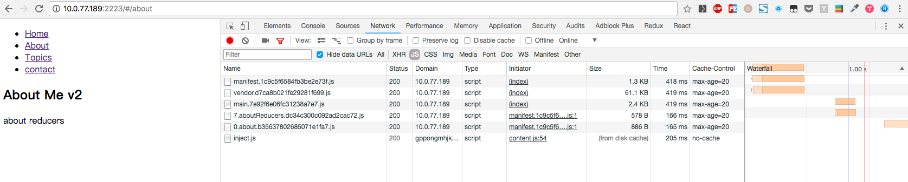
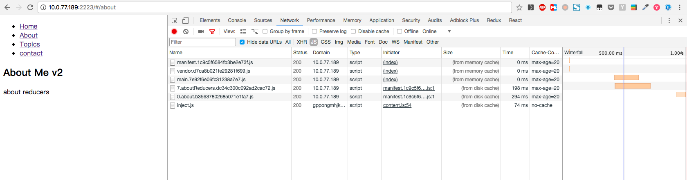
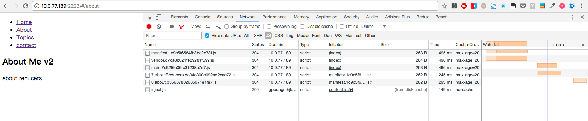
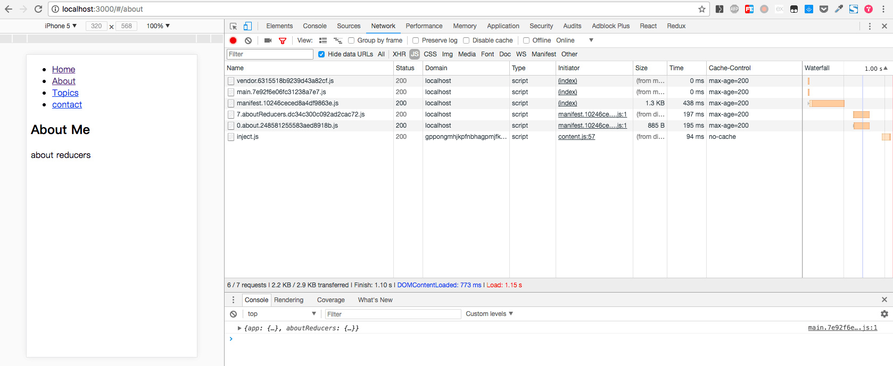
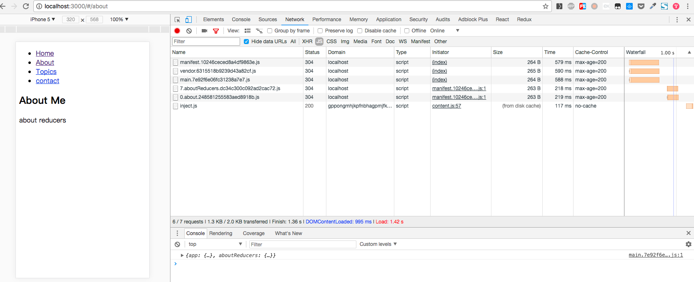
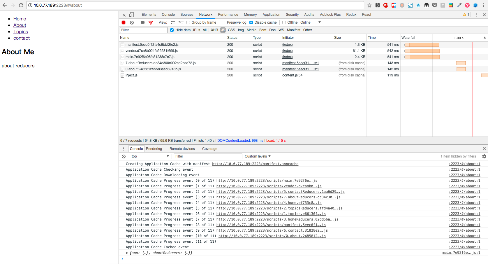
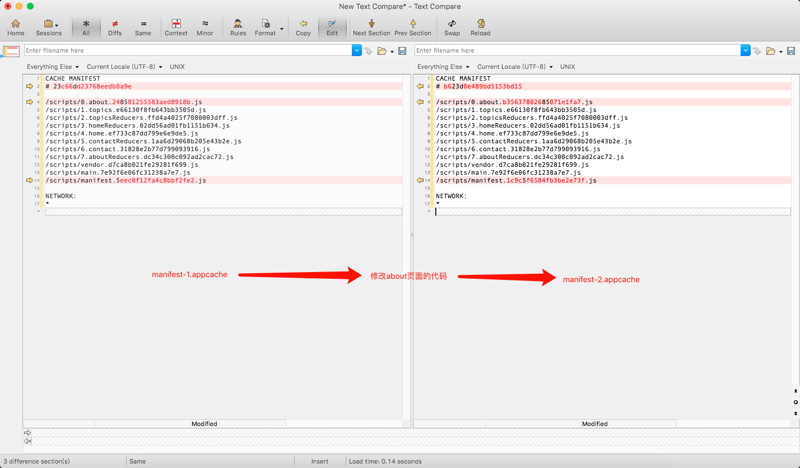
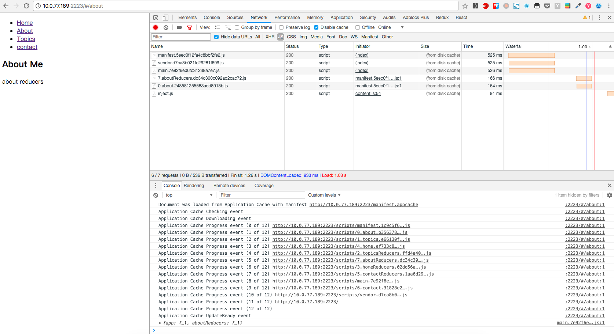
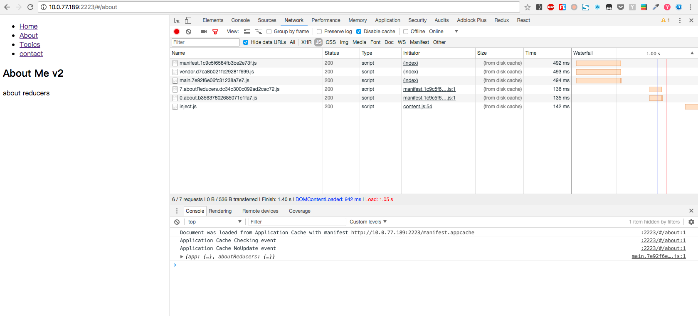

# 使用`import()`语法动态导入模块

## 说明

1. 使用`import()`语法动态导入，`webpack`会将动态导入的模块打包成独立的`chunk`文件，按需加载（去服务器请求）模块。

2. 按需加载模块，会提升应用首次加载速度。并且，还可以优化缓存，当你只修改了属于某一个`chunk`文件的代码，最后打包编译，只有这个`chunk`文件的`hash`
   值会变，而其他的`chunk`文件的`hash`不会改变。实验结果：

左侧是第一次打包编译的输出，右侧是修改`about`模块的代码，再次打包编译的输出。可以看到，只有`2.chunk.js`和`manifest.js`的`hash`值发生了变化。

那么配合`appcache`或者浏览器的静态文件缓存特性，修改`about`模块后发布，应用将只会去服务器重新拉取`2.chunk.js`和`manifest.js`。

3. 使用`appcache-webpack-plugin`可以将生成的`chunk`文件名写入到`manifest.appcache`文件中

## 配合`http`缓存

**注意：验证此实验需要设置`package.json`中`npm run serve`命令中`http-server`的缓存时间(`-c200`)大于修改`about`页面，打包编译，再次访问页面的时间**

使用`http-server`作为静态文件服务器，缓存头`max-age=20`

1. 首次加载某个页面，缓存未命中，走网络请求，从服务器拉取`vendor`, `app`和页面相应的`chunk`文件，`http`缓存将静态资源缓存，开始走`http`缓存流程。

缓存流程如图 1-1, 1-2, 1-3

1-1 首次访问

1-2 刷新页面，`max-age` 未过期

1-3 刷新页面，`max-age` 已过期，但由于这个[原因](https://developers.google.com/web/fundamentals/performance/optimizing-content-efficiency/http-caching?hl=zh-cn)， 只会发送请求头部，与服务器进行对比，不会请求资源实体

2. 修改`about`页面，打包编译发布，再次进入相同的页面

2-1 首次访问，`about`页面的资源`hash`发生变化， 客户端会重新请求，其他资源依旧在`max-age`缓存有效期内，因此走浏览器缓存(`http`缓存)

2-2 刷新页面，`max-age`未过期，同 1-2

2-3 等待`max-age`过期，再次刷新页面

3. 应用有新的迭代发布，`webpack`打包编译时，只有被修改文件的`hash`改变。对于`hash`有变化的资源文件，http 缓存未命中，再次走网络请求从服务器拉取。
   `hash`未改变的文件，本地缓存命中，使用`http`缓存文件。

## 配合`appcache`

实验步骤：

1. 打包编译，生成静态资源和`manifest.appcache`文件，在浏览器首次访问

**查看`appcache progress event`**可知，`appcache`**全量**缓存`manifest.appcache`文件中`CACHE MANIFEST`中罗列的所有静态资源，

2. 修改`about`页面的代码，再次打包编译，比对这次和首次`manifest.appcache`文件中的静态资源名称

只有`about`页面的`chunk`文件`hash`值发生变化

3. 浏览器再次访问

1. 第一次进入（刷新）页面

**查看`appcache progress event`**可知，`appcache`**再次全量**缓存`manifest.appcache`文件中`CACHE MANIFEST`中罗列的所有静态资源，应用使用和运行的是首次缓存的静态资源

2. 第二次进入（刷新）页面

应用使用和运行的是第二次缓存（最新）的静态资源

参考链接：

https://github.com/smileyby/manifest
